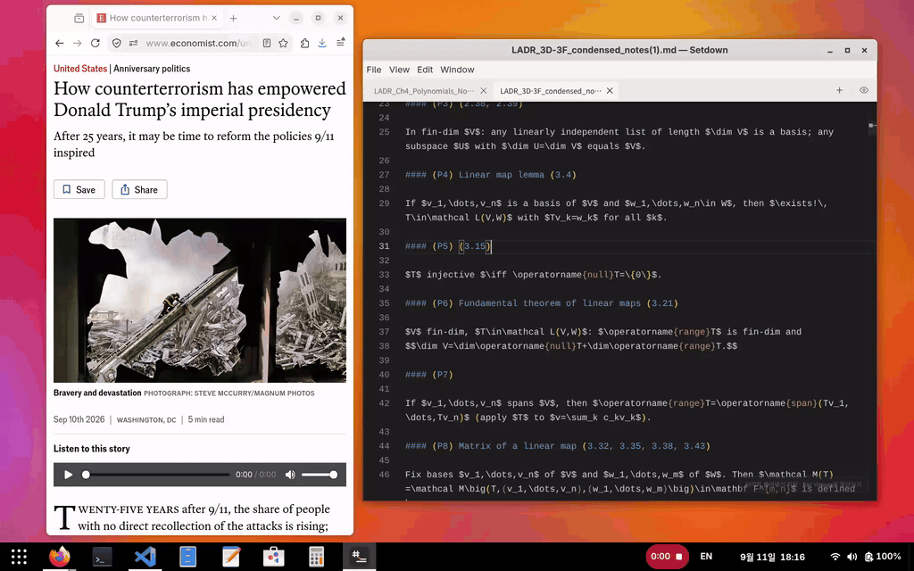
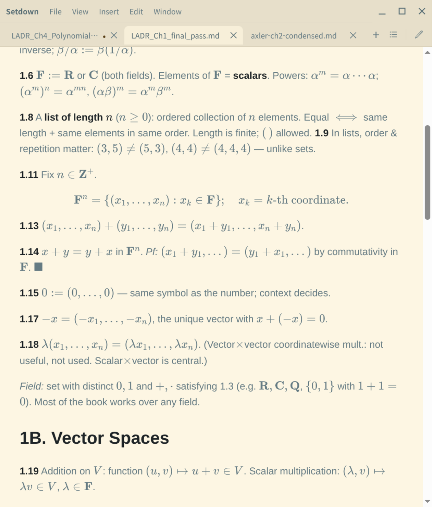
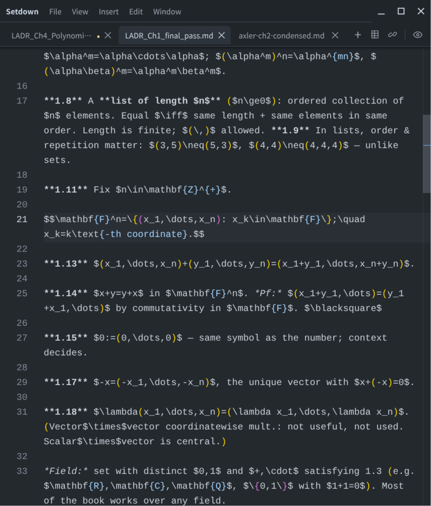
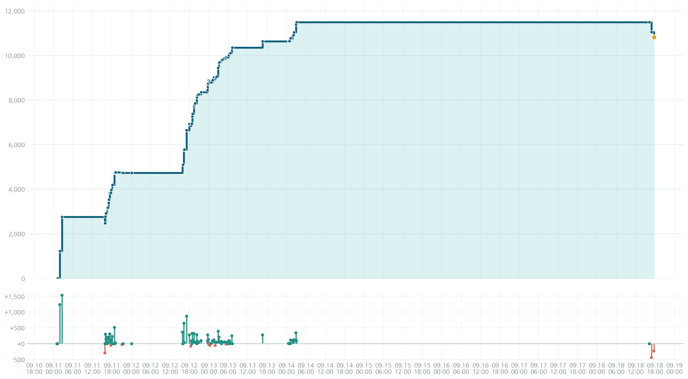

<p align="center">
  
</p>

<h1 align="center">Setdown</h1>

<p align="center">
  Write plain. Read beautifully.<br>
  A finished document when you read; familiar Markdown when you edit.
</p>

<p align="center">
  
</p>

Setdown is a desktop document app for local Markdown files. It presents equations,
tables, and images as a typeset document. Double-click anything that needs work and
the source opens at the corresponding position. The Viewer and Editor are two views
of the same document, not separate workspaces.

<table>
  <tr>
    <td></td>
    <td></td>
  </tr>
</table>

## Core experience

### Edit exactly where you were reading

Double-click a paragraph, equation, image, or nearby whitespace in the Viewer to
open the Editor at its corresponding source location. Press `Esc` to return to the
same visual position. Setdown maps the viewport you were reading, not merely a
single cursor coordinate.

```text
page 5 → edit → page 5
```

### Document tabs with zero switch latency

Every tab retains its live Viewer DOM and scroll position, Editor model and cursor,
current mode, and save state. Switching tabs does not reload or re-typeset a document
that is already open. Tabs can be reordered, detached into a new window, or moved to
another Setdown window.

While you edit, Setdown prepares the next Preview in the background and keeps the
last completed Viewer visible until the new revision is ready. Even a math-heavy
document never has to replace useful content with a blank or incomplete Preview.

### Reading tools

- A per-document outline built from the headings in the rendered result
- Preview search with previous and next navigation via `Ctrl/Cmd+F`
- PDF export
- Paper, GitHub, One Dark, Dracula, Nord, Sepia, and Solarized Dark themes
- Detection of external file changes

The selected theme is applied to the Viewer, application chrome, and Monaco Editor
across every open window. Changing it does not reload the Preview URL or re-render
Markdown, so search results and reading positions remain intact. The preference is
restored on the next launch.

### Small helpers for repetitive Markdown

The Editor keeps Markdown visible and editable while handling the structures that
are tedious to type by hand:

- Choose a table size from a compact 10 × 10 grid, or convert selected TSV data.
- Insert an HTTP, HTTPS, mail, telephone, or portable local-file link.
- Paste a URL over selected text to turn the selection into a link immediately.

The table and URL tools live in the Editor toolbar instead of a separate `Insert`
menu. Their output is ordinary Markdown and can be undone in one step.

### Paste images, keep ordinary Markdown

Paste an image into the Editor and Setdown creates the appropriate Markdown and
asset:

- A web image keeps its original HTTP or HTTPS URL.
- An image copied from a file manager is copied in its original format to
  `<document name>.assets/`.
- A screenshot or pixel image is stored as a PNG asset.

Images pasted into an unsaved document live in an internal draft bundle. After a
successful Save As operation, Setdown moves the Markdown and its assets to the final
location as one transaction.

## Install and run

### From the repository

```bash
npm install
npm start
```

You can also pass the document to open:

```bash
npm start -- /absolute/path/to/document.md
```

### Linux / GNOME user installation

```bash
npm install
npm run install:linux
```

This installs Setdown for the current user without administrator privileges. Launch
it from the GNOME application grid or open a Markdown file from the file manager.
The application is installed under `~/.local/share/setdown` and its desktop entry is
registered in the user application directory.

To build distribution artifacts without installing them:

```bash
npm run package:linux
```

The AppImage and deb packages are written to `apps/desktop/release/`.

### Windows installer

Build the NSIS installer on Windows:

```powershell
npm install
npm run package:win
```

The installer is per-user, allows the installation directory to be selected, and
can create desktop and Start menu shortcuts together with Markdown file associations.

## Repository structure

The repository is organized first by deployable application. Inside each app, code
is divided by process boundary and responsibility. Future mobile or server products
belong in their own workspaces under `apps/`. Code moves to `packages/` only when at
least two applications actually share it.

```text
apps/
├── desktop/
│   ├── src/
│   │   ├── core/             Pure domain rules with no UI or Electron dependency
│   │   ├── protocol/         Serializable IPC contracts
│   │   ├── main/             Electron system adapters and composition root
│   │   ├── preload/          Safe renderer IPC boundary
│   │   ├── preview-runtime/  Runtime for isolated Reader WebContents
│   │   └── renderer/
│   │       ├── application/  Input and surface-transition use cases
│   │       ├── ports/        Interfaces required by the renderer
│   │       ├── adapters/     Electron and Monaco implementations
│   │       └── */            Svelte UI and feature controllers
│   └── test/
└── code-growth/              Repository growth graph app and generated output
```

Dependencies point inward. `core` knows nothing about the execution environment,
and `protocol` contains only transferable data. Process entry points assemble
objects; Electron globals remain isolated in adapters. Automated architecture tests
enforce these boundaries.

## Controls

| Action | Mouse / keyboard |
| --- | --- |
| Edit a location from the Viewer | Double-click it |
| Return from Editor to Viewer | `Esc` |
| Toggle Viewer / Editor | `Ctrl/Cmd+E` or the icon on the right of the tab bar |
| Find in the rendered document | `Ctrl/Cmd+F` |
| New window | `Ctrl/Cmd+Shift+N` |
| New document | `Ctrl/Cmd+N` |
| Open file | `Ctrl/Cmd+O` |
| Save / Save As | `Ctrl/Cmd+S` / `Ctrl/Cmd+Shift+S` |
| Insert URL | `Ctrl/Cmd+K` or the Editor toolbar |
| Insert table | Editor toolbar |
| Close tab | `Ctrl/Cmd+W` |
| Next / previous tab | `Ctrl+Tab` / `Ctrl+Shift+Tab` |
| Reorder or detach a tab | Drag the tab |
| Actual size / zoom in / zoom out | `Ctrl/Cmd+0` / `Ctrl/Cmd++` / `Ctrl/Cmd+-` |

PDF export, theme selection, and window management are also available from the
in-window `File · View · Edit · Window` menu. The commands remain accessible in full
screen without relying on a separate operating-system menu bar.

## How it works

Setdown uses the rendering engine from
[Crossnote](https://github.com/shd101wyy/vscode-markdown-preview-enhanced) and the
same [Monaco Editor](https://microsoft.github.io/monaco-editor/) used by VS Code.

### Viewport-preserving transitions

`ViewportAnchor` carries a source line and column, its relative vertical position in
the viewport, and the evidence used to derive the mapping. When the cursor is visible
in the Editor, the wrapped visual line is preferred. Otherwise, Setdown gathers all
visible source lines into a band and uses a center of mass weighted by each rendered
block's height. Long paragraphs and equations therefore cannot push all mapping error
to one edge of the screen.

- [`viewport-anchor.ts`](apps/desktop/src/core/preview/viewport-anchor.ts) always
  resolves a valid viewport coordinate.
- [`bridge.ts`](apps/desktop/src/preview-runtime/bridge.ts) connects rendered DOM
  positions to source locations.
- [`source-anchors.ts`](apps/desktop/src/main/preview/source-anchors.ts) preserves
  source metadata for equations and raw HTML.

### Revision-aware, live Previews

Every render result has a revision number, and only the newest result that still
matches its document can be installed. A late render can never appear in another
tab. Each live Preview remains in its own `WebContentsView`, so tab switching is a
visibility change rather than a reload.

When a tab moves to a window with identical content geometry, Setdown preserves its
pixel scroll position. If a different width changes line wrapping, source anchors
and relative viewport positions recover the same content. Transfers use an internal,
single-use ID rather than exposing a document path or URL.

### A render pipeline that does not block the UI

Markdown-it and KaTeX typesetting run in a dedicated Electron utility process, away
from the main process. Windows, tabs, typing, and IPC remain responsive while a large
math document renders.

- Crossnote notebooks and KaTeX results are reused by document directory and theme.
- Math markup is restored after Crossnote post-processing to avoid parsing an
  unnecessarily large intermediate DOM.
- Documents are split into source blocks so updates patch only the changed range.
- A spare Preview `WebContentsView` is prewarmed to remove first-navigation cost.
- The Editor and last completed Viewer remain alive while the next revision is built.

Consequently, `Esc` and tab switching never wait for typesetting. The previous
complete document stays visible until a complete new revision can replace it.

### Safety for local documents

The Viewer runs on a separate `marktex-preview:` origin. Local resource access is
limited to the current document directory and the required Crossnote assets. Code
chunks, per-document `.crossnote` scripts and configuration, and HTML5 embeds are
disabled so untrusted documents can be opened safely.

Unsaved documents use an isolated `<userData>/drafts/<UUID>/` bundle. Save As removes
the draft only after both asset copying and Markdown link rewriting succeed.

## Development and verification

### Repository growth

The graph below plots source, test, and build-code size against actual commit time.

<p align="center">
  
</p>

Regenerate it with:

```bash
npm run plot:code-growth
```

### Checks

```bash
npm run typecheck
npm test
npm run build
npm run test:e2e
```

If the environment sets `ELECTRON_RUN_AS_NODE=1`, remove that variable only for the
Electron command.

The test suite covers document revisions, Preview races, Viewer-to-Editor coordinate
mapping, detached tabs, theme propagation, outline and search behavior, image assets,
and draft transactions.

The repository includes upstream source as submodules for implementation comparison
and specification checks. Normal builds use npm dependencies. To fetch the reference
sources as well:

```bash
git submodule update --init --recursive
```

- `vendor/vscode`: Monaco and VS Code behavior reference
- `vendor/vscode-markdown-preview-enhanced`: Markdown Preview Enhanced integration reference
- `vendor/commonmark-spec`: CommonMark behavior reference

## Design records

- [Screen-first HTML↔Markdown position mapping](reports/2026_09_11_01_56_screen_first_html_markdown_position_mapping.md)
- [Keeping the last Preview visible during math rendering](reports/2026_09_11_02_28_keep_last_preview_during_math_rendering.md)
- [Revision-aware Preview prerendering](reports/2026_09_11_15_50_revision_aware_preview_prerender_strategy.md)
- [Draft asset bundles for untitled documents](reports/2026_09_11_18_00_untitled_draft_asset_bundle_strategy.md)
- [Tab detachment and WebContents ownership transfer](reports/2026_09_12_15_51_tab_detach_webcontents_reparenting_architecture.md)
- [Preview outline, search, and theme plan](reports/2026_09_12_16_30_preview_toc_search_theme_plan.md)
- [Separating Preview controls from theme state](reports/2026_09_12_17_27_preview_controls_and_theme_state_architecture.md)
- [Preview iframe compositing experiment](reports/2026_09_12_18_20_preview_iframe_compositing_architecture.md)
- [Unified product theming](reports/2026_09_12_18_38_unified_product_theme_architecture.md)
- [Zero-wait Preview transitions](reports/2026_09_12_20_14_zero_wait_preview_transition_architecture.md)
