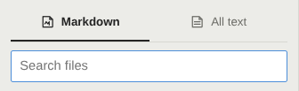
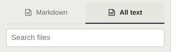

# Search scope styling validation

Both search scopes now use the placeholder **Search files**. The scope buttons
are flat, square tabs with a bottom selection rule; they use the application
palette and retain visible keyboard focus. Scope selection and search behavior
are unchanged. The screenshots are from the built Electron app:

| Markdown | All text |
| --- | --- |
|  |  |

## Checks

- Real Electron: both scopes have the expected `aria-pressed` state and show
  the same placeholder; both screenshots were captured from the app.
- `npm run test:preview-contract`: 124 focused unit tests, three comparator
  tests, production build/typecheck and 22 Electron/Chromium tests passed.
- `git diff --check`: passed.

## Preview performance comparison

The separate baseline and candidate checkouts are at commit
`408070fd1730782ce57729f338c1be66a81e54b3`. The baseline contains the unmodified search
controls; the candidate contains this CSS/text change. The same locked
dependency files were installed under both checkout paths. Each launched its
own Electron path. On a 1440 × 1000 Xvfb display, three matched repetitions
alternated baseline/candidate order. Every scenario completed with five cycles,
current edited content and a nonempty capture. All 48 buckets passed the
contract thresholds of **both** 25% and 50 ms.

Median milliseconds across runs are shown as baseline → candidate. First and
second cycles are separate; warm is the median of cycles 3–5 within each run.
Capture includes polling, IPC and native readback, not monitor presentation.
Double-click is actual mouse input until source is editable. Preparation is
0 or 3000 ms in the source view before Esc.

| Surface | Edit | Preparation | Capture first | Capture second | Capture warm | Double-click first | Double-click second | Double-click warm |
| --- | --- | --- | ---: | ---: | ---: | ---: | ---: | ---: |
| Document | No | 0 ms | 56 → 81 | 24 → 26 | 29 → 24 | 34 → 18 | 56 → 51 | 21 → 21 |
| Document | Yes | 0 ms | 443 → 413 | 93 → 91 | 82 → 82 | 14 → 17 | 11 → 15 | 14 → 14 |
| Document | No | 3000 ms | 72 → 70 | 31 → 35 | 25 → 22 | 28 → 27 | 25 → 24 | 23 → 23 |
| Document | Yes | 3000 ms | 134 → 118 | 118 → 104 | 95 → 86 | 28 → 29 | 29 → 27 | 24 → 26 |
| Review | No | 0 ms | 1310 → 1197 | 28 → 28 | 29 → 29 | 39 → 43 | 12 → 13 | 19 → 20 |
| Review | Yes | 0 ms | 1343 → 1350 | 1769 → 1792 | 223 → 225 | 45 → 47 | 22 → 25 | 20 → 23 |
| Review | No | 3000 ms | 50 → 51 | 19 → 25 | 29 → 25 | 43 → 39 | 13 → 14 | 18 → 18 |
| Review | Yes | 3000 ms | 232 → 231 | 227 → 228 | 179 → 171 | 41 → 44 | 36 → 37 | 19 → 18 |

The [comparison data](search-scope-benchmark-2026-09-21.json) includes all
48 medians and their three matched samples. Full per-run JSON and logs are
at `/tmp/setdown-search-scope-benchmark`. These measurements verify the
protected transition paths; they do not measure clicking the scope tabs.
