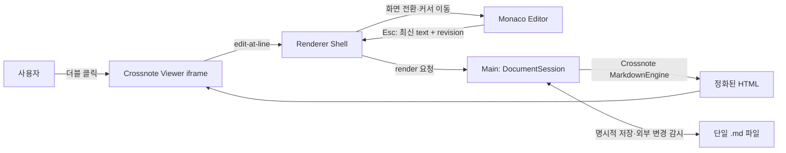

# Monaco Editor + Crossnote 단일 문서 편집기 계획안

## 결론: 작은 앱이어야 하지만, 작은 엔진이어서는 안 된다

이 프로그램의 중심에는 파일도, 폴더도, 편집기도 없다. 중심에는 지금 읽고 있는 **한 편의 문서**가 있다. 앱을 열면 Crossnote가 만든 완성된 문서가 먼저 보이고, 고치고 싶은 문단을 더블 클릭하면 같은 자리에서 Monaco Editor의 원문 화면으로 넘어간다. `Esc`를 누르면 변경한 내용이 즉시 다시 렌더링된다. 저장은 별개의 행위다. `Esc`는 보기로 돌아갈 뿐이며, `Ctrl/Cmd+S`가 디스크에 기록한다.

이를 구현하는 가장 좋은 방법은 Electron 셸 안에 두 화면을 나란히 두되 한 번에 하나만 드러내는 것이다. Viewer는 Crossnote, Editor는 Monaco가 맡는다. 디렉터리 트리, 다중 패널, 터미널, 확장 마켓은 만들지 않는다. 운영체제에서 `.md` 파일을 여는 행위 자체가 프로젝트 선택을 대신한다. 상대 이미지와 `@import`를 해석하기 위해 내부적으로는 파일의 부모 디렉터리를 Crossnote notebook 경계로 삼지만, 그 디렉터리를 사용자 인터페이스로 승격시키지 않는다.

이번에 추가한 서브모듈을 읽어 보면 이 구상은 처음부터 새로 만들어야 하는 공상이 아니다. Crossnote 0.9.35는 이미 Monaco를 이용한 프리뷰 내부 편집기, 원문 행을 HTML에 심는 source map, `Esc` 처리, 서버와 브라우저 양쪽의 HTML 정화를 갖고 있다. Monaco 서브모듈은 0.56.0이며 Markdown용 Monarch 토크나이저와 편집기 기반 기능을 제공한다. 우리가 할 일은 이 부품을 그대로 노출하는 것이 아니라, “블록별 작은 편집기”였던 Crossnote의 아이디어를 “문서 전체를 오가는 두 표면”으로 정리하는 것이다.

## 사용자가 실제로 겪게 될 일

앱은 마지막에 열었던 문서나 운영체제가 넘긴 `.md` 파일 하나를 Viewer로 연다. 창의 대부분은 조판된 본문이고, 제목 표시줄에는 파일명과 변경 여부만 보인다. 파일을 바꾸는 수단은 `Ctrl/Cmd+O`, 최근 문서 메뉴, 드래그 앤 드롭이면 충분하다. 탭을 넣고 싶다면 훗날 “창 하나에 문서 하나” 원칙을 먼저 검증한 뒤 결정한다.

Viewer에서 평범한 본문을 더블 클릭하면 가장 가까운 `data-source-line`을 찾는다. 화면은 Monaco로 바뀌고, 그 행으로 커서가 이동하며 문단 범위가 보이도록 스크롤된다. 편집기는 VS Code처럼 Markdown 기호를 색칠하지만, 렌더링하지는 않는다. 이 거친 화면 역시 충분히 읽기 좋아야 한다는 것이 제품의 중요한 전제다.

Editor에서 `Esc`를 누르면 현재 Monaco model의 값을 메모리 문서에 반영하고 Viewer를 다시 만든다. 이때 파일은 저장되지 않는다. 따라서 사용자는 생각의 흐름을 끊는 저장 확인창 없이 읽기와 수정을 왕복할 수 있다. 닫기나 다른 파일 열기에서만 저장되지 않은 변경을 묻는다. `Ctrl/Cmd+S`는 어느 화면에서든 저장한다.

키 하나에는 한 번에 한 의미만 부여한다. 자동완성, 찾기 창, 명령 팔레트 같은 Monaco의 임시 UI가 열려 있으면 첫 `Esc`는 그것을 닫고, 다음 `Esc`가 Viewer로 돌아간다. 한글 IME 조합 중인 `Esc`도 모드 전환으로 가로채지 않는다. Crossnote의 기존 코드도 suggestion widget이 열린 동안에는 `Esc`로 위젯만 닫는다. 이 작은 예외가 편집기를 장난감과 도구로 가른다.

더블 클릭도 무조건 빼앗지 않는다. 링크, 체크박스, 복사 버튼, 확대 가능한 그림, 다이어그램의 조작 영역에서는 본래 동작을 우선한다. 텍스트 선택을 위한 더블 클릭은 첫 번째 릴리스에서 편집 진입과 겹칠 수 있다. 이를 줄이기 위해 본문 블록의 빈 여백과 텍스트에만 진입을 허용하고, `Ctrl/Cmd+E`를 언제나 쓸 수 있는 대체 전환키로 둔다.

## 서브모듈이 이미 증명한 것

Crossnote는 Markdown token의 시작 행을 HTML 속성으로 옮긴다. 단순하지만 이 앱의 손잡이가 되는 코드다.

```ts
// vendor/crossnote/src/custom-markdown-it-features/sourcemap.ts
if (
  token.type.endsWith('_open') &&
  token.map !== null &&
  token.map[0] !== undefined
) {
  token.attrSet('data-source-line', `${token.map[0] + 1}`);
}
```

Transformer도 표, fenced block, heading처럼 markdown-it의 기본 경로만으로 행 정보가 보존되지 않는 구조에 `data-source-line`을 별도로 주입한다. 프리뷰 컨테이너는 이 속성을 모아 블록별 원문 범위를 계산한다. 즉 더블 클릭 시 “대략 이 근처”로 보내기 위해 새 parser를 만들 이유가 없다. Crossnote가 만든 숫자를 호스트 메시지로 전달하면 된다.

더 흥미로운 대목은 Crossnote의 [MarkdownEditor.tsx](../vendor/crossnote/src/webview/components/MarkdownEditor.tsx)다. 이 컴포넌트는 `@monaco-editor/react`를 쓰고, 로컬 Monaco를 명시적으로 로드하며, 선택된 렌더 블록의 원문 범위를 선택한다. `Esc`의 우선순위도 이미 다음처럼 처리한다.

```ts
editor.addCommand(Monaco.KeyCode.Escape, function () {
  if (isSuggestionWidgetOpened.current) {
    editor.trigger('keyboard', 'hideSuggestWidget', {});
  } else {
    closeEditor();
  }
});
```

그러나 이 컴포넌트를 제품 UI로 그대로 사용하지는 않는다. 현재 방식은 Monaco를 선택한 HTML element 안에 portal로 삽입하고, 저장과 폐기를 블록 편집의 종료 조건으로 삼는다. 우리가 원하는 것은 전체 문서 model 하나, 하나의 undo history, 그리고 저장과 무관한 Viewer 전환이다. 따라서 Crossnote의 source-map 계산과 예외 처리에서는 배우되, Monaco는 앱 셸이 소유한다. Crossnote webview의 편집 버튼과 내장 `MarkdownEditor`는 lean viewer build에서 제외한다. 이것은 UI 취향뿐 아니라 번들에 Monaco가 두 벌 들어가는 일을 막는다.

Monaco 쪽에도 한 가지 경계가 있다. [markdown.ts](../vendor/monaco-editor/src/languages/definitions/markdown/markdown.ts)는 heading, list, emphasis, link, HTML, fenced code를 처리하는 Monarch 문법이다. 빠르고 가볍지만 VS Code의 Markdown 색칠과 완전히 같은 엔진은 아니다. VS Code는 TextMate grammar와 Oniguruma를 사용한다. “VS Code 같은 느낌”이면 기본 Monaco도 충분하지만, 이 제품의 목표는 VS Code 경험의 복제에 가깝다. 그러므로 MVP의 조작 검증은 Monarch로 시작하되, 정식 1.0의 완료 조건에는 VS Code의 Markdown TextMate grammar, Oniguruma WASM, VS Code 색상 테마의 scope 규칙을 연결하는 작업을 넣는다. 파일 탐색기와 workbench 전체를 가져올 필요는 없다.

또 하나의 현실적인 버전 문제가 있다. 현재 Crossnote package는 `monaco-editor ^0.55.0`에 맞춰 특정 ESM 경로를 직접 import하며, 주석에는 0.56의 export 변경 때문에 0.55에 고정한다고 적혀 있다. 반면 추가한 Monaco 서브모듈은 0.56.0이다. 따라서 dependency hoisting으로 둘을 억지로 하나로 만들면 안 된다. 앱 소유 Editor는 0.56.0을 쓰고, Crossnote lean viewer에서는 Monaco import 자체를 제거한다. 이 분리가 끝나기 전에는 “중복을 없애겠다”며 버전을 통합하지 않는다.

## 구조: 한 문서, 두 표면, 세 개의 신뢰 구역



Electron main process는 파일 읽기·쓰기, 최근 문서, 외부 변경 감시, Crossnote `Notebook`과 `MarkdownEngine`, export를 소유한다. renderer shell은 Monaco model과 화면 상태만 관리한다. Crossnote 결과는 sandboxed iframe에 넣는다. preload는 `open`, `save`, `render`, `watch`, `revealPath`처럼 좁고 타입이 정해진 IPC만 공개하며, renderer나 Markdown HTML에 Node API를 노출하지 않는다.

`DocumentSession`은 다음 네 가지를 구분해야 한다.

```ts
type DocumentSession = {
  path: string;
  text: string;          // 현재 메모리 원문
  revision: number;      // 편집할 때마다 증가
  savedRevision: number; // 디스크와 일치하는 마지막 revision
  diskVersion: { mtimeMs: number; size: number };
};

type Surface =
  | { kind: 'viewer'; anchorLine: number }
  | { kind: 'editor'; cursorLine: number; cursorColumn: number };
```

Monaco의 `ITextModel`은 창이 살아 있는 동안 한 번만 만들고, 화면 전환 때 dispose하지 않는다. 그래야 undo stack, selection, 접기 상태가 남는다. model 변경은 150~250ms debounce로 session에 전달하되, `Esc`와 저장 직전에는 반드시 flush한다. render 요청에는 revision을 붙이고, 늦게 끝난 이전 render 결과는 버린다. 긴 문서에서 타이핑할 때마다 Crossnote를 돌리지 않고 Editor가 열려 있는 동안은 렌더를 미룬다. `Esc` 한 번에 최신 문서를 렌더하는 편이 사용자의 정신 모형에도 맞는다.

Crossnote는 `Notebook.init()`에 절대 notebook 경로를 요구한다. 이 앱은 열린 파일의 부모 폴더로 notebook을 초기화한다. 이는 탐색기를 만들기 위한 것이 아니라 `./image.png`, `@import`, CSS와 설정의 기준점을 제공하기 위해서다. 한 파일이 다른 폴더로 Save As 되면 notebook과 engine을 다시 만든다. 같은 부모 폴더의 파일을 연다면 인스턴스를 재사용할 수 있다.

Viewer는 `MarkdownEngine.generateHTMLTemplateForPreview()`가 만드는 전체 템플릿을 출발점으로 삼는다. 이 경로는 `parseMD()`뿐 아니라 테마 CSS, 수학·다이어그램용 리소스와 preview client를 함께 조립한다. 다만 VS Code webview의 메시지 객체를 기대하는 부분에는 Electron host adapter를 둔다. 첫 기술 실험은 Mermaid, KaTeX, 로컬 이미지, 링크, source map을 포함한 fixture가 VS Code 밖에서도 같은 결과를 내는지 확인하는 일이다. 단순히 `parseMD()`의 HTML만 body에 넣으면 일부 client-side renderer를 잃을 수 있으므로 이를 MVP의 지름길로 삼지 않는다.

### Viewer와 Editor 사이의 위치 보존

Viewer에서 Editor로 갈 때는 더블 클릭 대상 자신이나 가장 가까운 조상의 `data-source-line`을 읽는다. Crossnote의 프리뷰 코드는 source line element들을 모아 다음 시작 행 전까지를 현재 블록 범위로 간주한다. 앱에서는 우선 시작 행으로 커서를 보내고, 해당 범위를 중앙에 드러낸다. 문장 안의 정확한 column 추정은 HTML과 Markdown의 모양이 달라 오류가 크므로 1.0 범위에서 제외한다.

Editor에서 Viewer로 돌아갈 때는 cursor line 이하에서 가장 가까운 source-mapped element를 선택한다. 새 HTML을 iframe에 넣은 뒤 그 element가 전환 전 화면에서 차지하던 상대적인 세로 위치에 오도록 스크롤한다. 단순히 `scrollIntoView({block: 'center'})`만 쓰면 왕복할 때 문서가 계속 흔들린다. “커서가 화면 상단에서 35% 지점에 있었다” 같은 viewport offset까지 저장해야 전환이 한 장의 종이를 뒤집는 것처럼 느껴진다.

## 보안은 기능 플래그가 아니라 문서의 출처에서 시작한다

Markdown은 텍스트지만 Crossnote는 raw HTML, include, code chunk, PlantUML server 같은 넓은 기능을 다룬다. 알 수 없는 파일을 더블 클릭해 여는 데스크톱 앱에서는 모든 문서를 처음에는 untrusted로 취급해야 한다.

Crossnote 자체는 이미 두 겹의 방어를 제공한다. [markdown-engine/sanitize.ts](../vendor/crossnote/src/markdown-engine/sanitize.ts)는 executable script와 event handler, 위험한 URL을 제거하고 iframe을 sandbox한다. [webview/lib/sanitize.ts](../vendor/crossnote/src/webview/lib/sanitize.ts)는 DOMPurify로 브라우저 삽입 직전에 다시 정화한다. 이 두 경로를 우회하지 않는다. `Notebook.previewScriptsEnabled`도 config에서 켤 수 없고 호스트만 설정하도록 설계돼 있으므로 기본값 `false`를 유지한다.

초기 릴리스에서는 code chunk 실행, shell command, 임의 `.crossnote/config.js`, 사용자 script, 자동 image upload를 꺼 둔다. 사용자가 문서 또는 폴더를 신뢰한다고 명시했을 때만 기능별로 연다. 로컬 이미지 접근도 현재 파일의 부모 폴더와 사용자가 따로 허용한 경로로 제한하고, 외부 링크는 system browser로 넘기기 전에 URL scheme을 검사한다.

## 구현 순서

첫 주에는 제품의 가장 위험한 세 지점만 실험한다. Crossnote 전체 preview template을 Electron sandbox에서 띄우는 실험, `data-source-line` 왕복 실험, Monaco 0.56과 VS Code TextMate 색칠의 결합 실험이다. 각 실험은 버리는 demo가 아니라 fixture와 자동화된 회귀 테스트로 남긴다. 여기서 preview bundle에서 내장 Monaco를 제거하는 최소 patch의 경계도 정한다.

둘째 주에는 단일 문서 셸을 만든다. OS file association, Open/Save/Save As, atomic write, dirty 표시, 최근 파일, 외부 변경 감지를 완성한다. 저장은 같은 폴더의 임시 파일을 쓴 뒤 rename하는 방식으로 하며, 원본의 newline 형식과 가능한 한 encoding을 보존한다. 디스크가 외부에서 바뀌었는데 메모리에도 변경이 있으면 덮어쓰지 않고 비교·다시 불러오기 선택을 제시한다.

셋째 주에는 Monaco를 제품 수준으로 만든다. persistent model, undo/redo, 찾기·바꾸기, multi-cursor, word wrap, font·theme, Markdown completion, fenced language 색칠을 붙인다. VS Code의 Markdown fixture와 나란히 찍은 screenshot diff를 만들어 색상 차이를 관리한다. 모든 VS Code 기능을 흉내 내는 것이 아니라 “원문을 읽고 고치는 촉감”에 필요한 부분을 가져온다.

넷째 주에는 Crossnote Viewer와 전환을 완성한다. 더블 클릭 예외, `Esc` 우선순위, scroll anchor, stale render 취소, 에러 overlay를 넣는다. 렌더 실패 시 마지막 성공 화면을 보존하고, 오류와 원문으로 돌아가는 버튼을 얹는다. 잘못된 Mermaid 하나가 문서 전체를 백지로 만들면 안 된다.

다섯째 주에는 보안과 패키징을 다룬다. CSP, iframe sandbox, protocol handler, 경로 traversal, symlink, untrusted config를 시험한다. Linux·Windows·macOS에서 공백과 한글이 든 경로, 상대 이미지, 큰 파일, file association을 확인한다. PDF/Pandoc/code chunk 같은 확장 기능은 이 기반이 안정된 뒤 순차적으로 연다.

<details>
<summary>제안하는 앱 디렉터리 구조</summary>

```text
app/
├── main/
│   ├── documents/DocumentSession.ts
│   ├── documents/AtomicWriter.ts
│   ├── preview/CrossnoteHost.ts
│   ├── preview/RenderQueue.ts
│   ├── security/TrustStore.ts
│   └── ipc/registerDocumentIpc.ts
├── preload/
│   └── index.ts
├── renderer/
│   ├── shell/DocumentSurface.tsx
│   ├── editor/MonacoSurface.tsx
│   ├── editor/textmate.ts
│   ├── viewer/CrossnoteFrame.tsx
│   └── state/documentMachine.ts
├── crossnote-viewer/
│   ├── host-adapter.ts
│   └── entry.tsx
└── test-fixtures/
    ├── kitchen-sink.md
    ├── relative-assets.md
    ├── malicious-html.md
    └── large-document.md

vendor/
├── crossnote/       # 0.9.35 submodule
└── monaco-editor/   # 0.56.0 submodule
```

</details>

## 시험과 완료 조건

기능이 많다는 사실보다 왕복이 자연스럽다는 사실을 먼저 측정한다. 핵심 시나리오는 “파일 열기 → 다섯 번째 문단 더블 클릭 → 한 줄 수정 → `Esc` → 같은 문단이 같은 높이에서 새 내용으로 보임 → 저장 → 재실행”이다. 이 과정이 마우스와 키보드 어느 쪽에서도 끊기지 않아야 한다.

자동 시험은 세 층으로 둔다. Crossnote fixture는 HTML과 `data-source-line`이 기대대로 생성되는지 확인한다. 상태 시험은 revision 경쟁, `Esc` flush, dirty/saved 분리, 외부 변경 충돌을 검증한다. Playwright 기반 데스크톱 시험은 실제 더블 클릭, 커서 이동, scroll offset, IME와 팝업의 `Esc` 우선순위를 다룬다. 별도로 kitchen-sink 문서를 Markdown Preview Enhanced와 이 앱에서 렌더해 screenshot을 비교하고, 원문 화면은 같은 테마의 VS Code와 비교한다.

1.0은 다음 조건을 만족할 때 끝난다.

- 디렉터리 UI 없이 `.md` 하나를 OS에서 직접 열고 저장할 수 있다.
- Viewer의 일반 블록을 더블 클릭하면 대응하는 원문 행이 Monaco 중앙에 나타난다.
- `Esc`는 변경을 잃거나 강제로 저장하지 않고 Viewer로 돌아가며, 늦은 render가 최신 결과를 덮지 않는다.
- Viewer와 Editor를 열 번 왕복해도 undo history와 시각적 위치가 유지된다.
- KaTeX, Mermaid, 표, footnote, 상대 이미지, fenced code가 Markdown Preview Enhanced와 실질적으로 같은 결과를 낸다.
- Monaco의 Markdown 색칠이 선정한 VS Code 테마와 TextMate fixture에서 일치한다.
- 신뢰하지 않은 문서의 script, event handler, 위험 URL, code chunk는 실행되지 않는다.
- 1만 행 문서에서도 첫 Viewer 표시와 `Esc` 재렌더에 명백한 멈춤이 없고, 측정한 성능 예산을 CI에 기록한다.

## 의도적으로 만들지 않을 것

이 앱은 축소판 VS Code가 아니다. 파일 탐색기, Git 패널, 터미널, workspace search, extension marketplace, 상시 split preview는 1.0에 없다. Crossnote가 notebook이라는 말을 쓴다고 해서 notebook UI를 보여 줄 필요도 없다. 내부의 폴더 문맥은 상대 경로를 올바르게 해석하기 위한 기반시설일 뿐이다.

반대로 단순함을 핑계로 엔진의 깊이를 버리지도 않는다. 사용자는 평소에는 아름다운 한 장의 문서만 보지만, 그 아래에는 Monaco의 검증된 편집 모델과 Crossnote의 넓은 Markdown 해석력이 남아 있다. 이 비대칭이 제품의 정체성이다. 화면은 MarkText처럼 조용하고, 원문은 VS Code처럼 믿을 만하며, 렌더 결과는 Markdown Preview Enhanced만큼 풍부해야 한다.

## 최종 판단

이 계획의 핵심 선택은 Crossnote의 기존 인라인 편집기를 확장하는 것이 아니라, 그 코드가 증명한 source map과 예외 규칙을 독립된 전면 Monaco에 옮기는 데 있다. 그래야 한 파일에 집중한다는 제품 원칙과 VS Code 수준의 편집 경험이 충돌하지 않는다. 가장 먼저 만들어야 할 것은 메뉴나 테마 선택창이 아니다. kitchen-sink 문서 한 편을 열어, 아무 문단이나 더블 클릭하고, 고친 뒤 `Esc`를 눌렀을 때 같은 자리에 더 나은 문장이 나타나는 10초짜리 왕복이다. 그 순간이 자연스러우면 나머지는 기능이다. 자연스럽지 않으면 나머지는 짐이다.
