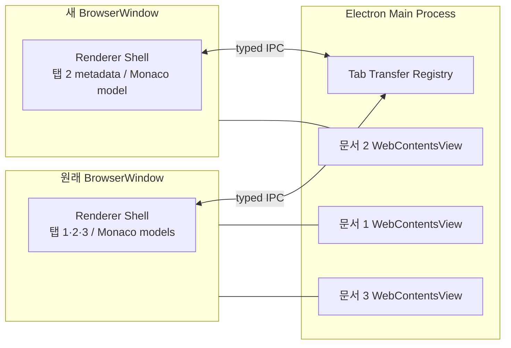
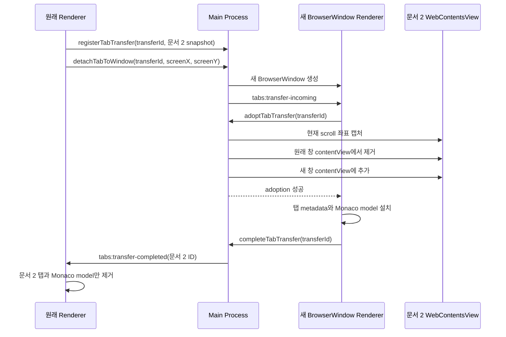

# 탭 분리 기능의 본질: Preview WebContents 소유권 이전

## 결론

탭 분리는 “문서 데이터를 새 창에 복사하는 기능”이 아니다. 정확한 탭 분리는 **드래그한 탭이 소유한 실행 중인 화면 객체를 기존 창에서 떼어 새 창에 재부착하는 기능**이다.

문서 1, 2, 3이 원래 창에 있을 때 문서 2를 밖으로 드래그했다면 반드시 다음 결과가 나와야 한다.

```text
분리 전
원래 창: [문서 1] [문서 2] [문서 3]

분리 후
원래 창: [문서 1] [문서 3]
새 창:   [문서 2]
```

이때 보존해야 하는 것은 파일 경로와 Markdown 원문만이 아니다. 사용자가 보던 Preview의 다음 상태도 같은 탭의 정체성에 포함된다.

- 이미 생성된 HTML DOM
- KaTeX 등 조판이 끝난 렌더 결과
- JavaScript 실행 상태
- 현재 scroll 위치
- 현재 문서 높이와 viewport 상태
- Preview와 연결된 source anchor 상태

기존 iframe 구조에서는 이 상태가 원래 `BrowserWindow`의 renderer DOM에 종속되어 있었다. iframe element를 다른 `BrowserWindow`로 옮길 수 없기 때문에 새 창에서는 URL을 다시 열어야 했고, 이는 새 문서를 렌더링하는 것과 같은 결과를 냈다. 이 제약을 피하려고 원래 창에 드래그한 문서를 남기고 나머지 탭을 새 창에 복원하는 방식을 사용하면 Preview DOM은 살릴 수 있지만 창의 정체성이 뒤집힌다.

이번 해결에서는 문서별 Preview를 renderer 소유 iframe에서 main process 소유 `WebContentsView`로 바꿨다. 탭을 분리할 때는 같은 `WebContentsView`와 같은 `webContents.id`를 새 `BrowserWindow`의 `contentView`로 옮긴다. 그러므로 새 창에서 Preview URL을 다시 열거나 HTML을 다시 만들 필요가 없다.

## 관찰된 문제는 세 개였지만 원인은 하나였다

### 1. Firefox가 `setdown-tab:<uuid>`를 열었다

탭 드래그 데이터가 운영체제가 이해하는 일반 텍스트나 URL 형식으로 노출되면, Electron 밖으로 나간 drag payload를 데스크톱 환경이나 브라우저가 외부 URL로 처리할 수 있다. 내부 탭 전송 식별자는 애플리케이션 전용 정보이므로 브라우저가 소비할 수 있는 `text/plain`으로 제공하면 안 된다.

현재 구현은 `application/x-setdown-tab`이라는 전용 MIME에 transfer ID만 넣는다. 이 ID는 main process의 메모리 registry에서만 의미가 있으며 실제 문서 경로나 HTML을 drag payload에 싣지 않는다.

### 2. 원래 렌더링 페이지의 높이가 사라졌다

iframe의 `src`를 새 창에서 다시 열면 새 navigation이 발생한다. 새 document는 처음에는 layout이 끝나지 않았고, 숨겨진 surface라면 viewport 높이가 0일 수도 있다. 기존 DOM의 전체 높이와 스크롤 컨테이너는 이 시점에 이미 폐기되었으므로 이전 높이를 참조할 수 없다.

### 3. 5페이지를 보다가 1페이지로 이동했다

이 현상은 단순한 scroll 값 저장 실패가 아니라 새 browsing context가 만들어진 결과였다. 재로드된 Preview의 초기 scroll 위치는 0이다. 이전 scroll ratio나 source line을 나중에 적용해도 font, 수식, 이미지의 layout 시점이 다르면 화면이 흔들리거나 다른 위치로 갈 수 있다.

세 문제의 공통 원인은 탭을 하나의 살아 있는 화면 객체로 취급하지 않고, 새 창에서 재생성할 수 있는 직렬화 데이터로만 취급한 데 있었다.

## 기존 우회 구조가 왜 본질적으로 틀렸는가

iframe DOM을 유지하려면 iframe을 소유한 원래 renderer도 유지해야 한다. 이 제약 아래에서 다음과 같은 우회가 가능하다.

```text
원래 창 renderer가 문서 2의 iframe을 소유함
                  │
                  ├─ 문서 2를 유지
                  └─ 문서 1·3을 새 BrowserWindow에 복원
```

화면 배치만 보면 원래 창을 드래그 위치로 움직이고 새 창을 원래 위치에 만들 수 있다. 그러나 사용자 관점의 창 정체성은 다음처럼 뒤집힌다.

```text
실제 객체 기준
원래 BrowserWindow: 문서 2
새 BrowserWindow:   문서 1, 3
```

이 방식은 다음 부작용을 낳는다.

- 새 창의 `ready-to-show`가 원래 창보다 늦게 실행되어 앞으로 튀어나올 수 있다.
- focus, z-order, task switcher 순서가 사용자의 기대와 달라진다.
- Wayland compositor에 맞춘 `alwaysOnTop`, `moveTop`, 지연 focus 같은 보정이 필요해진다.
- 보정 순서가 달라지면 문서 2 창이 뒤로 가거나 문서 1·3 창이 앞으로 나온다.
- “원래 창은 나머지 탭을 유지한다”는 탭 UI의 기본 불변식을 위반한다.

따라서 이것은 stacking 문제도, GNOME 전용 focus 문제도 아니었다. **Preview를 renderer DOM에 묶어 둔 소유권 모델의 문제**였다.

## 새 소유권 모델

새 구조에서는 renderer shell과 Preview의 수명을 분리한다.



각 계층의 책임은 다음과 같다.

| 계층 | 소유하는 상태 |
|---|---|
| main process | Preview `WebContentsView`, 현재 소유 BrowserWindow ID, transfer transaction |
| renderer shell | 탭 순서, 활성 탭, Monaco model, 문서 metadata, editor view state |
| Preview WebContents | 렌더링된 DOM, layout, JavaScript 상태, scroll 위치 |
| preload bridge | renderer와 Preview 사이의 제한된 typed IPC |

`WebContentsView`는 main process 객체이므로 한 `BrowserWindow.contentView`에서 제거한 뒤 다른 창의 `contentView`에 추가할 수 있다. 이때 내부 `webContents`는 파괴되지 않는다.

반면 Monaco model은 원래 renderer process에 속한 JavaScript 객체이므로 창 사이에 직접 옮길 수 없다. 이 상태는 원문, revision, selection/view state를 직렬화하여 새 renderer에서 다시 만든다. 중요한 구분은 다음과 같다.

- Editor model: 직렬화하여 복원
- 렌더링된 Preview: 같은 실행 객체를 재부착

## 탭 분리는 소유권 이전 트랜잭션이다

탭 분리는 등록, claim, Preview adoption, commit의 네 단계로 처리한다.



여기서 가장 중요한 순서는 **새 창이 Preview를 인수하기 전에 원래 창이 탭을 제거하지 않는다**는 것이다.

main process는 transfer마다 다음 값을 기록한다.

```ts
type PendingTabTransfer = {
  sourceWebContentsId: number;
  tab: TransferableTab;
  claimedByWebContentsId: number | null;
  expiresAt: number;
  detachTimer: ReturnType<typeof setTimeout> | null;
  detachPosition: { x: number; y: number } | null;
  previewAdopted: boolean;
};
```

`completeTabTransfer`는 다음 조건이 모두 참일 때만 원래 renderer에 제거 명령을 보낸다.

1. 요청자가 transfer를 claim한 새 renderer다.
2. Preview의 owner ID가 새 renderer로 바뀌었다.
3. `previewAdopted`가 `true`다.

따라서 데이터 복원만 성공하고 Preview 이전이 실패한 반쪽짜리 transfer를 commit할 수 없다.

## 같은 WebContents를 유지해도 scroll을 별도로 보호하는 이유

실제 Electron 시험에서 같은 `webContents.id`와 JavaScript 전역 변수는 재부착 전후 유지되었다. 즉 navigation과 DOM 재생성은 일어나지 않았다. 그러나 `WebContentsView`를 한 창에서 제거하고 다른 창에 붙이는 짧은 순간에 Chromium이 viewport 높이를 0으로 계산할 수 있었다. 이때 유효 범위를 벗어난 `scrollY`가 clamp될 수 있다.

따라서 adoption은 재부착 직전에 현재 픽셀 좌표를 Preview 자체에서 읽는다.

```ts
const scrollPosition = await preview.view.webContents.executeJavaScript(
  '({ x: window.scrollX, y: window.scrollY })',
);
```

새 renderer가 실제 Preview 영역의 bounds를 전달하고 View를 표시한 직후 같은 좌표를 복원한다.

```ts
preview.view.setBounds(bounds);
preview.view.setVisible(true);
void preview.view.webContents.executeJavaScript(
  `window.scrollTo(${scrollPosition.x}, ${scrollPosition.y})`,
);
```

이것은 재렌더 후 위치를 추정하는 복구가 아니다. 같은 DOM의 viewport가 일시적으로 축소되는 동안 좌표가 손상되지 않도록 보호하는 것이다. source line이나 scroll ratio보다 실제 픽셀 좌표를 우선하는 이유도 DOM과 layout이 그대로이기 때문이다.

## Preview 표시와 메시지 전달

renderer에는 더 이상 iframe element가 없다. 대신 `.preview-frames`는 main process가 `WebContentsView` bounds를 맞추는 자리표시자 역할만 한다.

renderer는 활성 탭과 surface 상태에 따라 다음 정보를 main process에 보낸다.

```ts
const rect = previewFrames.getBoundingClientRect();
window.marktex.showPreview(tab.id, {
  x: rect.left,
  y: rect.top,
  width: rect.width,
  height: rect.height,
});
```

창 resize, surface 전환, Preview render 완료 때 bounds와 visibility를 다시 동기화한다. 비활성 탭의 `WebContentsView`는 숨기지만 파괴하지 않는다.

iframe 시절의 `window.parent.postMessage`도 창 간 재부착 구조에는 맞지 않는다. Preview 전용 preload가 `ipcRenderer`를 통해 main process로 메시지를 보내고, main process는 현재 owner renderer로 전달한다.

```text
Preview bridge
  → preview preload
  → main process owner lookup
  → 현재 BrowserWindow renderer
```

renderer가 Preview에 위치 이동이나 anchor 요청을 보낼 때는 반대 방향 IPC를 사용한다. Preview owner가 바뀌면 main process의 owner ID만 바뀌므로 메시지 경로도 즉시 새 창을 향한다.

## 불변식

현재 구현이 지켜야 하는 핵심 불변식은 다음과 같다.

1. tab ID 하나에는 Preview `WebContentsView`가 최대 하나만 존재한다.
2. Preview View의 owner는 항상 정확히 하나의 BrowserWindow renderer ID다.
3. transfer 완료 전에는 원래 renderer의 탭을 제거하지 않는다.
4. Preview adoption 없이 transfer를 완료할 수 없다.
5. 이전된 Preview를 원래 renderer가 파괴하지 않는다.
6. 일반 탭 닫기에서는 해당 Preview를 명시적으로 파괴한다.
7. 창이 닫히면 그 창이 아직 소유한 Preview만 정리한다.
8. Preview URL은 `marktex-preview://document/`만 허용한다.
9. 외부 drag payload에는 `text/plain`이나 가짜 URL을 넣지 않는다.
10. 새 창은 드래그한 탭 하나를 받고, 원래 창 객체는 나머지 탭을 유지한다.

특히 5번과 6번의 구분이 중요하다. 탭을 다른 창으로 보낸 경우 원래 renderer에서는 Monaco model만 dispose한다. 이때 Preview까지 `destroyPreview`하면 새 창으로 이미 옮겨 간 살아 있는 DOM을 파괴하게 된다. 사용자가 탭을 닫은 경우에만 Preview WebContents를 종료한다.

## 변경된 주요 파일

| 파일 | 역할 |
|---|---|
| `src/main/main.ts` | Preview View registry, bounds/visibility, 탭 claim/adoption/commit, scroll 보호 |
| `src/renderer/main.ts` | iframe 제거, View 표시 동기화, 올바른 탭 제거·설치 순서 |
| `src/preview/preload.ts` | Preview WebContents 전용 IPC bridge |
| `src/preview/bridge.ts` | Preview 이벤트를 parent DOM 대신 host preload로 전달 |
| `src/preload/index.ts` | renderer에 Preview와 transfer API 노출 |
| `src/shared/contracts.ts` | Preview bounds/message와 adoption 계약 정의 |
| `scripts/build-electron.mjs` | Preview preload 별도 bundle 생성 |
| `test/e2e/tab-detach.spec.ts` | 창 정체성, Preview 객체 동일성, scroll, focus 회귀 시험 |

## 자동 시험이 증명하는 것

Playwright Electron 시험은 단순히 창 개수만 확인하지 않는다.

첫 번째 시험은 다음을 검증한다.

1. Preview의 `webContents.id`를 분리 전에 기록한다.
2. Preview 전역 객체에 식별용 값을 기록한다.
3. 긴 문서 중간으로 scroll한다.
4. 활성 탭을 새 창으로 분리한다.
5. 원래 창에는 나머지 탭만 있는지 확인한다.
6. 새 창에는 드래그한 탭만 있는지 확인한다.
7. 같은 `webContents.id`가 살아 있는지 확인한다.
8. 전역 식별값과 `scrollY`가 그대로인지 확인한다.
9. 새 창이 focused BrowserWindow인지 확인한다.

두 번째 시험은 사용자가 제시한 세 탭 사례를 직접 고정한다.

```text
초기:     원래 창 [sample.md, Untitled.md, Untitled 2.md]
동작:     가운데 Untitled.md 분리
기대 결과:
  원래 창 [sample.md, Untitled 2.md]
  새 창   [Untitled.md]
```

최종 검증 결과는 다음과 같다.

- TypeScript typecheck 통과
- 단위 시험 7개 파일, 52개 case 통과
- Electron 탭 분리 E2E 2개 case 통과
- Fedora 설치 스크립트 실행 완료

## 의도적으로 하지 않은 것

이번 해결에는 다음 방식이 들어 있지 않다.

- 원래 BrowserWindow를 드래그 위치로 움직이고 대체 창을 원래 위치에 만드는 방식
- `alwaysOnTop`을 잠깐 켜서 z-order를 강제로 맞추는 방식
- focus 지연 timer로 compositor의 결과를 덮는 방식
- Preview URL을 새 창에서 다시 load하는 방식
- 저장한 scroll ratio로 새 DOM의 위치를 추정하는 방식
- 드래그한 탭 대신 나머지 탭들을 새 창으로 보내는 방식

이들은 증상을 가릴 수는 있지만 탭 소유권을 바로잡지 못한다.

## 남은 경계와 확장 방향

현재 구조는 창 밖으로 분리하는 경우뿐 아니라 이미 존재하는 다른 Setdown 창의 탭 strip으로 옮기는 경우에도 같은 claim/adoption 절차를 사용한다. 다만 제품 수준에서 다음 실패 경로를 추가로 강화할 수 있다.

- adoption 뒤 새 renderer 설치가 예외로 끝난 경우 main process가 원래 owner로 rollback
- transfer 만료 시 claim 상태와 owner 상태를 함께 감사하는 정리 루틴
- 창별 zoom factor가 다를 때 CSS pixel과 DIP bounds 변환
- 창 종료와 transfer가 동시에 발생하는 경쟁 조건을 위한 별도 E2E
- 서로 다른 크기의 창 사이 이동에서 픽셀 scroll과 source anchor 중 무엇을 우선할지에 대한 정책

이 확장도 동일한 원칙을 따라야 한다. 실패 복구는 Preview를 새로 만드는 방식이 아니라, 살아 있는 Preview의 owner를 어느 창으로 되돌릴지 결정하는 방식이어야 한다.

## 최종 판단

이번 문제의 본질은 “어느 창을 앞으로 올릴 것인가”가 아니었다. “문서 2의 실제 화면을 누가 소유하는가”였다.

iframe을 renderer DOM 안에 두는 동안에는 실제 화면을 다른 BrowserWindow로 이전할 수 없었다. 그래서 Preview를 보존하려 할수록 창 정체성이 뒤집혔고, 창 정체성을 보존하려 할수록 Preview가 재생성되었다.

Preview를 main process 소유 `WebContentsView`로 승격하면서 두 요구가 더 이상 충돌하지 않는다.

```text
원래 BrowserWindow는 그대로 남는다.
드래그한 탭의 Preview WebContents도 그대로 남는다.
바뀌는 것은 Preview의 owner 관계뿐이다.
```

이것이 탭 분리 기능의 근본 해결이다.
